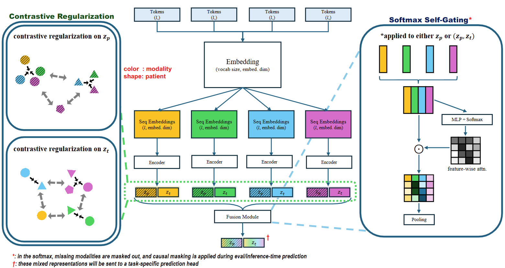
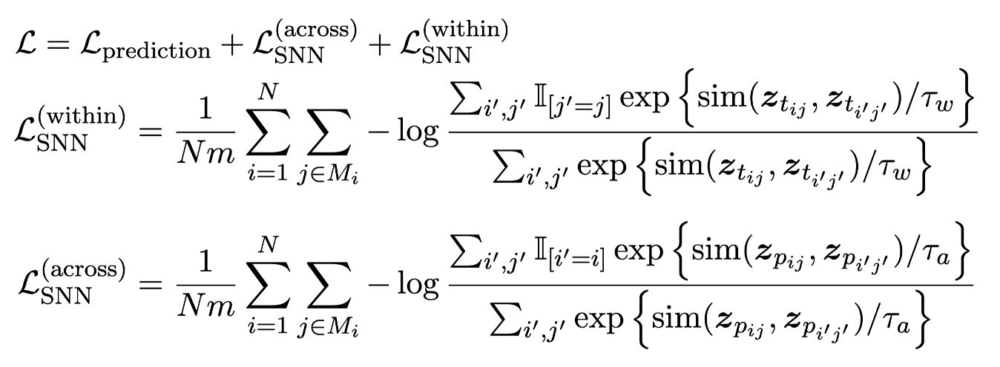

# Borrowing From the Future: Enhancing Early Risk Assessment through Contrastive Learning (MLHC'25)

## <span style="color: red;">TL;DR</span>
We present **B**orrowing **F**rom the **F**uture (BFF), which leverages future information to refine the learning of temporally earlier data and therefore enhance early risk prediction performance.
## What is BFF
### Overview
- Risk assessments made at later in time tend to be more accurate because: 
	- (i) additional information has accumulated over watchful waiting
	- (ii) the child is temporally closer to the potential onset of the condition. 
- Input data observed later in time tend to dominate the prediction

BFF, as a contrastive learning framework, utilizes future information as implicit guidance to refine the learning of temporally earlier data and therefore enhance early risk prediction performance.



BFF is motivated by CLIP [1], CMC [2], and SNN [3]. Softmax Self-Gating for multi-modal fusion is inspired by SE-block [4].

### Objective function

We use SNN contrastive objective [3] as the regularization terms to refine the repressentation learning of *modality-specific* features, $\boldsymbol{z}_t$, and *patient-specific* features, $\boldsymbol{z}_p$.

<p align="center"> 

### Characteristics of BFF compared to other approaches
<p align="center"> 


## ⚙️ Code & Environment Setting

### Code Structure
- `core/`: Contains the core components of the `BFF` framework and other approaches, including models, data utilities, trainers, and loss functions.
- `experimental_utils/`: Houses utility functions and modules used throughout the project.

[More details about the code](README-code.md)


### Environment
In this project, we tokenize the medical events using `torchtext==0.17.0`, which underwent siginificant changes in its APIs and functionalities compared to some of the previous versions. To ensure the compatiblity across packages and correct execution of our code in the repo, we name some of the key packages' versions below.
```
torch==2.2.0
torchtext==0.17.0
numpy==1.24.4
pandas==2.2.0
scikit-learn==1.6.1
scikit-survival==0.24.1
```