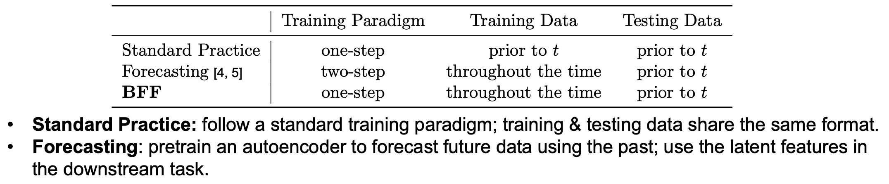

# Borrowing From the Future: Enhancing Early Risk Assessment through Contrastive Learning (MLHC'25)
code will be uploaded soon

## What is BFF
### TL;DR
- Risk assessments made at later in time tend to be more accurate because: 
	- (i) additional information has accumulated over watchful waiting
	- (ii) the child is temporally closer to the potential onset of the condition. 
- Input data observed later in time tend to dominate the prediction

We present **B**orrowing **F**rom the **F**uture (BFF), which leverages future information to refine the learning of temporally earlier data and therefore enhance early risk prediction performance.

BFF is motivated by CLIP [1], CMC [2], and SNN [3]. Softmax Self-Gating for multi-modal fusion is inspired by SE-block [4].

### Objective function

We use additional contrastive objective regularization terms to refine the repressentation learning of *modality-specific* features, $\boldsymbol{z}_t$, and *patient-specific* features, $\boldsymbol{z}_p$.

 

### Characteristics of BFF compared to other approaches

## Result
